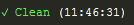

# (WIP) SAPUI5 Starter Kit

developed by Sebastian Mantsch, Eike Vogel & [Mark Deppe](http://www.mark-deppe.de/)


This starter kit is intended to help developers create, check, version, and upload SAPUI5 projects to the SAP system. It has been developed especially for use in Webstorm, but can also be applied to other IDEs if necessary.

Supported features are:
* Syntax checks with [ESLint](https://eslint.org/) and rules adapted for SAPUI5 developments
* Includes the two NPM packages [ui5-codecompletion](https://www.npmjs.com/package/ui5-codecompletion) and [ui5-schemas](https://www.npmjs.com/package/ui5-schemas) (configuration will be explained later)
* Automatic generation of pre-component, minification of JavaScript files and automated upload to the SAP system with [grunt](https://gruntjs.com/)

<b>Content</b>

* [Prerequisites](#chapter-1)
* [Installation](#chapter-2)
* [Usage](#chapter-3)
    * [Using ESLint](#chapter-3-1)
    * [Using grunt to build and upload project to SAP System](#chapter-3-2)
* [FAQ](#chapter-4)


## Prerequisites <a id="chapter-1"></a>
* IDE for JavaScript development (this kit has been developed and tested in Webstorm)
* Installed [node.js](https://nodejs.org)
* Windows OS for automated upload into SAP System (since [node-rfc](https://www.npmjs.com/package/node-rfc) is not working for Mac OS & ARM
* Installed [SAP NW RFC Library](http://sap.github.io/node-rfc/install.html#sap-nw-rfc-library-installation) (You need an SAP Marketplace Account)

## Installation <a id="chapter-2"></a>
1. Download or clone this Kit into your local repository
2. Open the project in Webstorm or other IDE
3. Make sure you have node configured in your IDE & SAP NW RFC library added to your OS classpath
4. Open IDE terminal or node.js command prompt (in this case you have to go to your repository manually)
5. Install the npm packages
```
npm install
```
6. Wait until all packages are installed

After this you should install also the two UI5 packages
```
npm run ui5
```
If this is not working, look into the [FAQ](#chapter-4) section.

***Important:***
If you want to use some version control tool like GIT or SVN, than you have to make sure, that the local folders and files are not commited. Add these files/folders to the SVN ignore list or use the provided .gitignore file.
The following files/folders are important to ignore:
* .tmp
* .ui5
* node_modules
* target

## Usage <a id="chapter-3"></a>
### Using ESLint <a id="chapter-3-1"></a>
There are three possible ways of using eslint.

The first one is to call ESLint check explicitly with the terminal each time you want to check it.
```
npm run lint
```
This will show all linting errors and warings in the console:


The second possibility is to let ESLint watch your code automatically after saving. Just type in the following:
```
npm start
```
Now leave the console open. Each time a JavaScript file is saved using Ctrl+S, ESLint automatically scans the project and fixes some of the typical formatting issues such as missing spaces (Yes, I know Webstorm actually saves the files automatically, so no explicit saving is necessary. Unfortunately it is still necessary for ESLint).



The third possibility is to let the respective IDE perform the ESLint checks. In Webstorm, this is done using the options menu. There ESLint only needs to be activated, then the eslint configuration file in the project folder is usually found and used automatically.


Personally, I prefer to combine options two and three. So I keep the check running in the console at all times and also activate the Webstorm check. However, I recommend that you reduce the standard inspections by Webstorm a little bit, as they are always marked too much in SAPUI5 projects anyway. Otherwise, it could quickly become rather confusing.
 
### Using grunt to build and upload project to SAP System <a id="chapter-3-2"></a>

Coming soon...
 


## FAQ <a id="chapter-4"></a>

##### What should I do if the UI5 packages configuration doesn't work?

Unfortunately, the configuration of the UI5 packages does not always work properly. In this case, it can help to install the packages manually globally.

Global installation of ui5-codecompletion
```
npm install -g ui5-codecompletion
```

Downloading of the UI5 SDK into local project folder
```
ui5-codecompletion install
```

If this is also not working, try to add the [latest OpenUI5 version](https://openui5.hana.ondemand.com/versionoverview.html)  manually.
```
ui5-codecompletion install --from=https://openui5.hana.ondemand.com/downloads/openui5-runtime-1.44.24.zip
````

Global installation of ui5-schemas
```
npm install -g ui5-schemas
```

Configuration of ui5-schemas
```
ui5-schemas
```

If this is also not working, try to add the [latest SAPUI5 version](https://sapui5.hana.ondemand.com/versionoverview.html) manually.
```
ui5-schemas -v 1.44.24  
```
